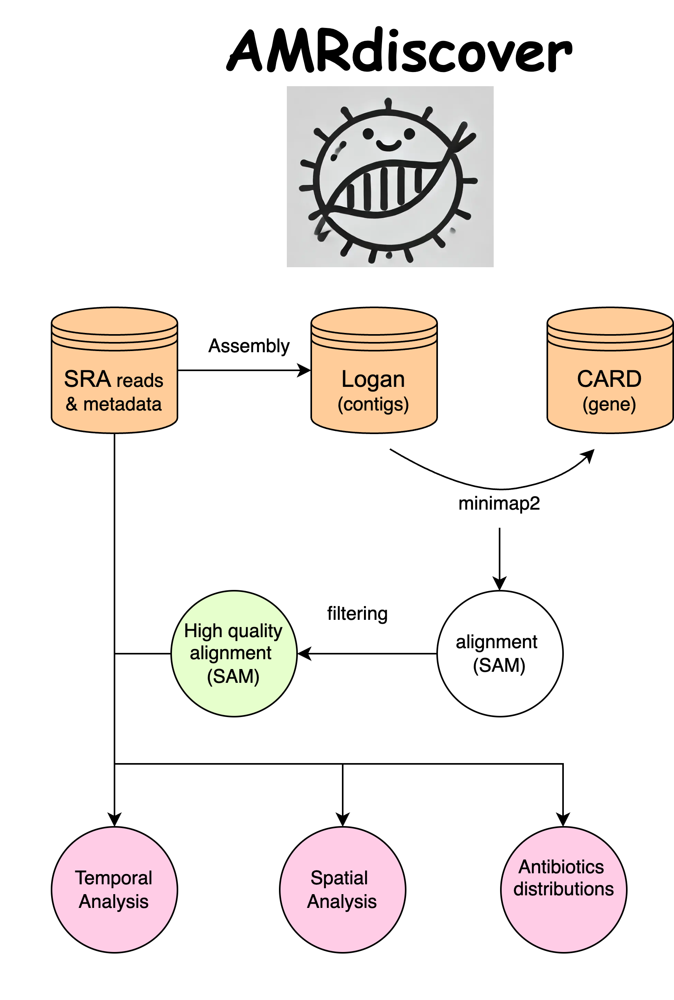
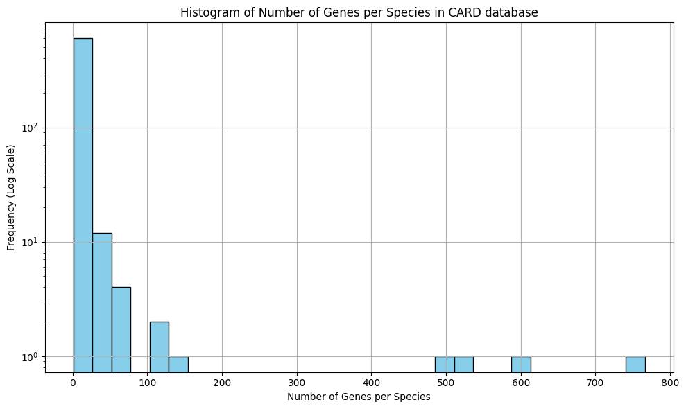
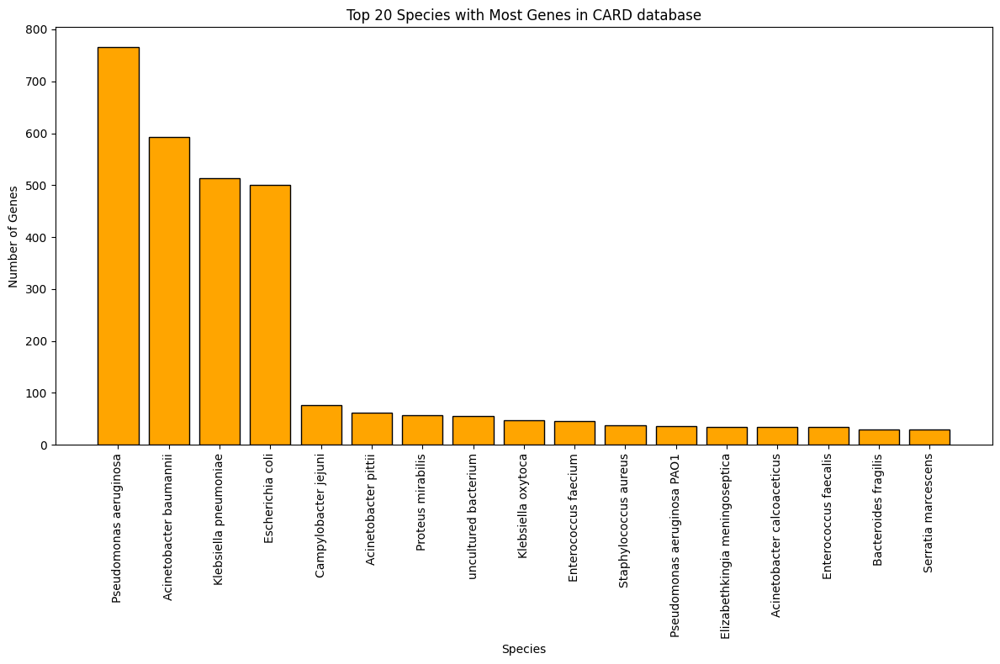
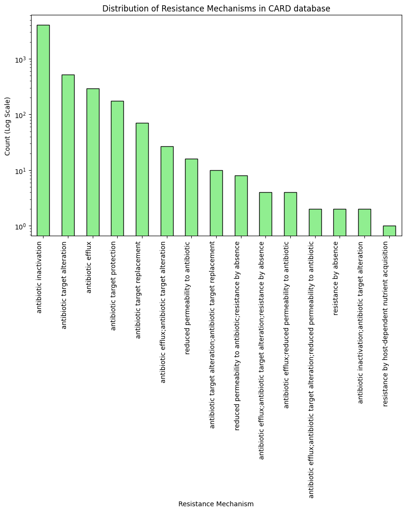
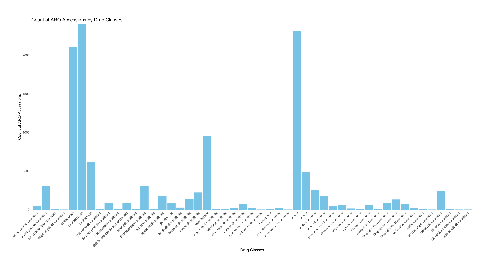

# 

# AMRDiscover 
### Analyzing Antimicrobial Resistance Genes in NCBI Sequence Read Archive
### BCM hackathon, August 2024.

Antimicrobial resistance (AMR) is a growing global health concern, driven by the overuse and misuse of antibiotics. Detecting and monitoring the presence of AMR genes in various environments is crucial for understanding the spread of resistance and informing public health strategies. The Logan database of assembled contigs and unitigs, derived from a massive freeze of the NCBI Sequence Read Archive (SRA), offers a unique and comprehensive resource for studying genetic material across a wide array of samples [(Chikhi et al., 2024\)](https://paperpile.com/c/BaoF4C/DreI).

In this project, we will align the genes of CARD (Comprehensive Antibiotic Resistance Database) [(Alcock et al., 2023\)](https://paperpile.com/c/BaoF4C/nj8p) to the Logan database to identify and catalog AMR genes present in the dataset. By leveraging the highly efficient unitigs and contigs of Logan, we aim to detect AMR genes with high accuracy and sensitivity, despite the inherent complexities and challenges of working with such a large-scale dataset [(Bradley et al., 2019\)](https://paperpile.com/c/BaoF4C/Zuh9)\[see section “***Antibiotic resistance genes in the ENA***”\]. This work will provide valuable insights into the distribution and prevalence of AMR genes across a vast range of environments and host organisms.


## Flowchart



## Software
Here is the code to run our pipeline!
```
./AMRdiscover.sh --input alignment_SAM_filenames.txt --download /path/to/download --upload /path/to/upload

```


## Results

### CARD Database Analysis

To get an overview of the composition of the CARD database we performed some general analyses of the overall dataset.

<p float="left">
  
  
</p>

<p float="left">
   
</p>

<p float="left">
   
</p>

#### Main Takeaways

- Most organisms contribute few AMR genes to the database, while few organisms contribute the bulk of AMR genes
- The top 4 organisms contributing AMR genes are the "usual suspects":
  - Pseudonomas aeruginosa
  - Acinetobacter baumannii
  - Klebsiella pneumoniae
  - Escherichia coli
- The most prevalent antibiotic mechanism is antibiotic inactivation, but several other mechanisms are prevalent

## Summary of Procedures

1. Data Preparation  
   1. Download (subset) unitigs/contigs from the Logan database.  
      2. Obtain the CARD database containing curated sequences of known AMR genes ([link](https://card.mcmaster.ca/download/), [file](https://card.mcmaster.ca/download/0/broadstreet-v3.2.9.tar.bz2)) \[Daniel to github\]  
      3. Download the metadata (data/location) of SRA accessions \[Kristen\]  
      4. Parse the metadata of SRA accessions   
   2. Alignment and Detection  
      1. Align the sequences from the CARD database to the Logan unitigs/contigs using appropriate bioinformatics tools using [minimap2](https://gitlab.pasteur.fr/rchikhi\_pasteur/logan-analysis/-/blob/master/batch/tasks/analysis\_aug26.sh?ref\_type=heads\#L113) [(Li, 2018\)](https://paperpile.com/c/BaoF4C/dzWG) and [Diamond](https://gitlab.pasteur.fr/rchikhi\_pasteur/logan-analysis/-/blob/master/batch/tasks/analysis\_aug26.sh?ref\_type=heads\#L89) [(Buchfink et al., 2015\)](https://paperpile.com/c/BaoF4C/EJYR)\[work in progress\]. \[\]  
      2. Identify and annotate matches, focusing on high-confidence alignments that suggest the presence of AMR genes.  
   3. Post-Processing  
      1. Filter and curate the results to remove low-confidence hits (alignment length, alignment identity using [NM tag](https://github.com/lh3/minimap2/issues/25))  
      2. Finding literature for AMR genes in SRA   
         1. Specific biological question \[Hassan\]  
         2.   
      3. Summarize the findings in terms of the presence, distribution, and frequency of different AMR genes across the samples including metadata.  
      4. Interpret the results considering the limitations of the approach.

## Possible Future Directions

1. Annotation and Visualization:  
   1. Develop scripts or pipelines to annotate AMR genes in the Logan dataset.  
   2. Create visualizations (e.g., heatmaps, phylogenetic trees, geographic plots) to represent the distribution of AMR genes across samples.  
2. Statistical Analysis:  
   1. Perform statistical tests to compare the prevalence of AMR genes across different environments or hosts.  
   2. Investigate correlations between the presence of AMR genes and metadata (e.g., sample origin, sequencing platform).

   

This project will not only contribute to the understanding of AMR gene distribution but also provide participants with hands-on experience in handling large-scale genomic datasets and applying bioinformatics tools in a real-world context.

## Extra information

The Logan database: 

* [https://github.com/IndexThePlanet/Logan](https://github.com/IndexThePlanet/Logan)  
* The Logan database is a comprehensive collection of DNA and RNA sequences assembled from the entire NCBI Sequence Read Archive, offering an efficient and condensed representation of vast genomic data through unitigs and contigs.

The CARD database: 

* [https://card.mcmaster.ca/](https://card.mcmaster.ca/)  
* The CARD (Comprehensive Antibiotic Resistance Database) is a curated repository of sequences and associated data for known antimicrobial resistance genes, providing a critical resource for the identification and study of resistance mechanisms in various organisms.

* For parsing CARD files, [this code](https://github.com/ratschlab/metagraph\_paper\_resources/blob/master/notebooks/metasub.ipynb) from [this paper](https://www.biorxiv.org/content/10.1101/2020.10.01.322164v4) might be helpful.   
  * aro\_metadata.tsv  & nucleotide\_fasta\_protein\_homolog\_model.fasta

Alignment results   
Instructions from Rayan [here](https://docs.google.com/document/d/1bAg4cFNDB3rXXyLHyxT9-8RiK2pos6HegNa8k-3X9dI/edit?usp=sharing)  

## References

[Alcock, B. P., Huynh, W., Chalil, R., Smith, K. W., Raphenya, A. R., Wlodarski, M. A., Edalatmand, A., Petkau, A., Syed, S. A., Tsang, K. K., Baker, S. J. C., Dave, M., McCarthy, M. C., Mukiri, K. M., Nasir, J. A., Golbon, B., Imtiaz, H., Jiang, X., Kaur, K., … McArthur, A. G. (2023). CARD 2023: expanded curation, support for machine learning, and resistome prediction at the Comprehensive Antibiotic Resistance Database. *Nucleic Acids Research*, *51*(D1), D690–D699.](http://paperpile.com/b/BaoF4C/nj8p)  
[Bradley, P., den Bakker, H. C., Rocha, E. P. C., McVean, G., & Iqbal, Z. (2019). Ultrafast search of all deposited bacterial and viral genomic data. *Nature Biotechnology*, *37*(2), 152–159.](http://paperpile.com/b/BaoF4C/Zuh9)  
[Buchfink, B., Xie, C., & Huson, D. H. (2015). Fast and sensitive protein alignment using DIAMOND. *Nature Methods*, *12*(1), 59–60.](http://paperpile.com/b/BaoF4C/EJYR)  
[Chikhi, R., Raffestin, B., Korobeynikov, A., Edgar, R., & Babaian, A. (2024). Logan: Planetary-Scale Genome Assembly Surveys Life’s Diversity. In *bioRxiv* (p. 2024.07.30.605881). https://doi.org/](http://paperpile.com/b/BaoF4C/DreI)[10.1101/2024.07.30.605881](http://dx.doi.org/10.1101/2024.07.30.605881)  
[Li, H. (2018). Minimap2: pairwise alignment for nucleotide sequences. *Bioinformatics* , *34*(18), 3094–3100.](http://paperpile.com/b/BaoF4C/dzWG)

## Team members:


| name | role | task |  | E-mail (gmail) | Github |  |
| :---- | :---- | :---- | :---- | :---- | :---- | :---- |
| Daniel | colead | Sysadmin |  | danielp.agustinho@gmail.com | DanielPAagustinho | DanielPA |
| Sina | colead |  |  | sina.majidian@gmail.com | sinamajidian | smajidian |
| Abohassan |  | Flowchart/ writer1 |  | abolhassanbahari@gmail.com | AbolhassanBahari | abolhassan |
| Kristen |  |  |  | kristendcurry@gmail.com | kdc10 | kristendcurry |
| Aanuoluwa |  |  |  | aanuoluwadekoya@gmail.com | aanuoluwaduro | aanuoluwaduro |
| Christian |  |  |  | christian.brueffer@insilico.consulting | [cbrueffer](https://github.com/cbrueffer) | cbrueffer |
| Jen-Yu |  | writer2 |  | jenyuw@uci.edu | jyw-atgithub | jenyuwang |
| Rayan |   |  |  |  |  |  |
| Narges |  |  |  | nargessangaranip@gmail.com | nargessangaranipour | NargesSangaraniPour |

roles to be distributed: Sysadmin DNAnexus /Github/ , Flowchart,  presenter\_day1, writer1, writer2

## ToDo list: (day1 )

Higher priority on top

- [ ] Prepare flowchart \[Hassan\]  
- [ ] Add people to the DNA nexus \[Daniel\]  
- [ ] Downloading Alignment to the DNA nexus \[ ? \]    
- [ ] parse the CARD database (strain info) [  ]
- [ ] Mainin Github [  ]
- [ ] Writer [ ] 
- [ ] Filtering alignment (think of tool, command line) [Jen-Yu, Daniel, Sina] (length, gens)
- [ ] Work on the metadata of SRA accessions \[Kristen\]  
- [ ] Literature on AMR genes and SRA \[Hassan\]

- [ ] Add people to the github 

Updates: 

